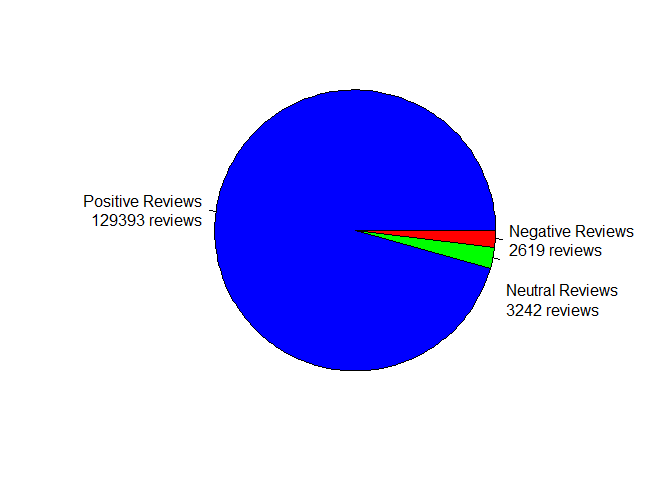
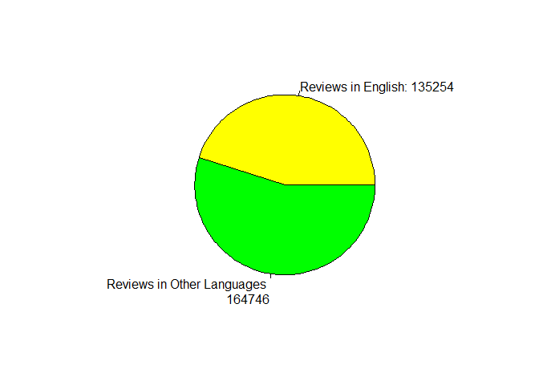
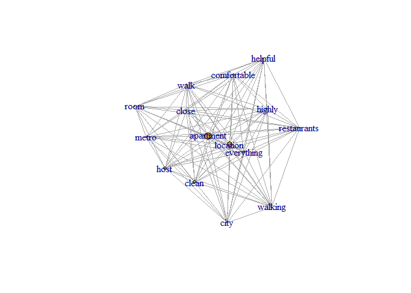
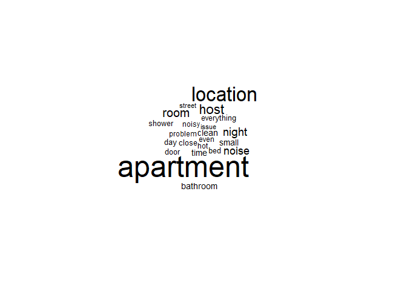
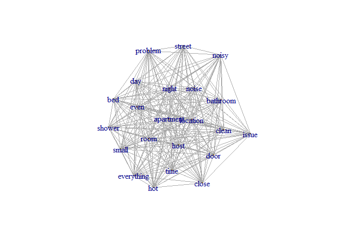
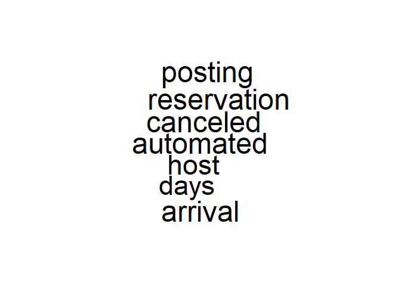

Sentiment analysis Tutorial on Airbnb Madrid reviews
================

<h5>

The dataset was taken from
<https://www.kaggle.com/rusiano/madrid-airbnb-data>

</h5>

1.  [Introduction.](#intro)
2.  [Preprocessing.](#preprocess)
3.  [Classification.](#classification)
4.  [Visualizations.](#visualization)
5.  [Sentiment Analysis.](#analysis)

<a name="intro"> </a>

<h3>

1.Introduction

</h3>

</br>

<ol>

<li>

Clean our environment

</li>

<li>

Set the working directory

</li>

<li>

Load R libraries

</li>

</ol>

``` r
rm(list=ls())
#setwd("{absolute path}")
library(tm)
library(textcat)
library(rlist)
library(wordcloud)
library(textcat)
library(translateR)
library(NLP)
library(sentimentr)
library(dplyr)
library(tidyr)
library(igraph)
```

<h4>

Load the dataset and choose a random sample of 300K reviews

</h4>

*Please refer to the
<a href ="https://github.com/ismailhelmy/Madrid-Airbnb-Reviews-Analysis/tree/master/preprocessing">preprocessing
module </a> before starting this tutorial*

``` r
full_dataset <-read.csv("preprocessed_reviews.csv", header = FALSE)
shuffled_dataset <- data.frame(full_dataset[sample(nrow(full_dataset),size = 300000),])
```

<a name="preprocess"> </a>

<h3>

2.Preprocessing

</h3>

</br> Use the library
<b><a href="https://cran.r-project.org/web/packages/textcat/textcat.pdf">textcat</a></b>
in order to identify English Reviews from non-English reviews

*This process takes upto 2 hours of runtime so We save the output in a
.csv file for future use Make sure to run it once and skip to the next
cell in the coming times*

``` r
sentence_vector <-  as.vector(shuffled_dataset)

english_reviews_vector <- sentence_vector$full_dataset.sample.nrow.full_dataset...size...3e.05....[textcat(sentence_vector$full_dataset.sample.nrow.full_dataset...size...3e.05....) == "english"]

write.csv2(as.vector(english_reviews_vector), 'shuffled_preprocessed_english_reviews.csv', row.names = FALSE)
```

<h4>Now we need to apply the final preprocessing to the reviews before
sentiment analysis start</h4>
</br> <b>
<li>Convert the english reviews vector into sentences in order to allow
further processing.</li>
</b> <b><li>Apply the last line of code to remove any special characters such as
emojis.</li></b>

``` r
english_reviews_vector <-read.csv("shuffled_preprocessed_english_reviews350k-700k.csv", header = TRUE)

english_reviews_vector <- get_sentences(as.vector(english_reviews_vector$x))

english_reviews_vector<-english_reviews_vector[!is.na(english_reviews_vector)]

english_reviews_vector<-get_sentences(as.vector(gsub("[^0-9A-Za-z///' ]","" , english_reviews_vector ,ignore.case = TRUE)))
```

<a name="classification"> </a>

<h3>

3.Classification

</h3>
<h4>Classify English reviews to positive, negative and neutral</h4>

Use the library
<b><a href = "https://cran.r-project.org/web/packages/sentimentr/sentimentr.pdf">sentimentR
</a></b> to get a matrix of consisting of a row for each sentence
represented with 4 elements

<li>Divide the reviews into positive, negative and neutral</li>

``` r
english_sentiments <- sentiment(english_reviews_vector)

positive_english_sentiments <- english_reviews_vector[english_sentiments$sentiment > 0]

neutral_english_sentiments <- english_reviews_vector[english_sentiments$sentiment == 0]

negative_english_sentiments <- english_reviews_vector[english_sentiments$sentiment < 0]
```

<a name="visualization"> </a>

<h3>4.Visualizations</h3>

<li><b>Visualize the ratio of positive to negative reviews through a pie
chart </b></li>

``` r
positive_rev_string <- 'Positive Reviews\n'+String(length(positive_english_sentiments))+ ' reviews'
neutral_rev_string <- '\n\n\n\nNeutral Reviews\n'+String(length(neutral_english_sentiments))+ ' reviews'
negative_rev_string <- 'Negative Reviews\n'+String(length(negative_english_sentiments))+ ' reviews'


pie(c(length(positive_english_sentiments),length(neutral_english_sentiments), length(negative_english_sentiments))
    ,labels = c(positive_rev_string,neutral_rev_string, negative_rev_string), radius = 1, 
    col = c('blue','green','red'))
```

<!-- -->

<li><b>Visualize the ratio of english to non-english reviews through a pie
chart </b></li>

``` r
english_reviews_string <- '\tReviews in English: '+ String(length(english_reviews_vector))
other_reviews_string <- '\nReviews in Other Languages \n   ' +  String(300000 - length(english_reviews_vector))

pie(c(length(english_reviews_vector),  300000 - length(english_reviews_vector)), labels = c(english_reviews_string,other_reviews_string), col = c('yellow','green'))
```

<!-- -->
<a name="analysis"> </a>

<h3>1.  Sentiment Analysis</h3>
    </br> <b>Sentiment Analysis on Positive reviews</b>
    <ol>
    <li>
    Construct a
    <a href = "https://cran.r-project.org/web/packages/tm/vignettes/tm.pdf">Corpus</a>
    object of the positive text
    </li>
    <li>
    Remove Words that are stop words for this particular subject of
    reviews that are too common in the text but we do not care about in
    our analysis
    </li>
    <li>
    Construct A document term matrix
    </li>
    <li>
    Remove the sparse terms with a sparsity ratio of 0.9
    </li>
    </ol>

<!-- end list -->

``` r
positive_corpus <- Corpus(VectorSource(positive_english_sentiments))
positive_corpus_filtered <- tm_map(positive_corpus, removeWords, c("madrid", "great", "would", "stay",
                                                                   "place","recommend","good", "really","well",
                                                                   "perfect","nice","also","easy","bit",
                                                                  "sol","time","etc","awesome","ana","need","needs",
                                                                  "wonderful","want","sure","its","like",
                                                                  "many","del","thanks","stayed",
                                                                  "much","take","anything","small",
                                                                   "made","one","two","especially",
                                                                   "felt","back","left","however",
                                                                   "let","thank","airbnb",
                                                                   "located", "excellent","get","even"
                                                                   ,"definitely","amazing","lovely","super"))

positive_dtm <- DocumentTermMatrix(positive_corpus_filtered)

positive_dtm <- removeSparseTerms(positive_dtm,0.9)
```

<b> View the Document term matrix</b>

``` r
inspect(positive_dtm)
```

    ## <<DocumentTermMatrix (documents: 129393, terms: 15)>>
    ## Non-/sparse entries: 391373/1549522
    ## Sparsity           : 80%
    ## Maximal term length: 11
    ## Weighting          : term frequency (tf)
    ## Sample             :
    ##         Terms
    ## Docs     apartment city clean close comfortable everything helpful host
    ##   114318         8    1     0     2           1          1       1    3
    ##   114835         8    0     1     1           1          1       0    8
    ##   115770        12    0     0     1           0          1       0    0
    ##   32218          9    2     0     1           0          3       2    0
    ##   32995          5    6     1     0           2          2       1    2
    ##   45317          7    4     1     1           2          1       0    1
    ##   53091         12    1     1     1           1          1       1    0
    ##   68384         18    1     0     0           2          1       1    4
    ##   9333           9    0     1     0           1          1       1    0
    ##   99072          7    3     2     1           0          2       1    2
    ##         Terms
    ## Docs     location metro
    ##   114318        0     1
    ##   114835        1     1
    ##   115770        1     5
    ##   32218         1     2
    ##   32995         0     1
    ##   45317         2     0
    ##   53091         2     2
    ##   68384         1     1
    ##   9333          1     2
    ##   99072         3     2

<b> The co-occurence matrix is calculated by multiplying the document
term matrix by its Transpose </b>

``` r
positive_cooccurrenceCounts <- t(as.matrix(positive_dtm)) %*% as.matrix(positive_dtm)
positive_sums <- colSums(as.matrix(positive_dtm))
sorted_positive_sums <- sort(positive_sums, decreasing = TRUE)
```

<b> The top 15 words mentioned in the positive reviews </b>

``` r
names(sorted_positive_sums)
```

    ##  [1] "apartment"   "location"    "clean"       "host"        "everything" 
    ##  [6] "close"       "metro"       "comfortable" "city"        "helpful"    
    ## [11] "walk"        "room"        "restaurants" "walking"     "highly"

A <a href = "https://cran.r-project.org/web/packages/wordcloud/wordcloud.pdf" >wordcloud
</a> of the top words sorted from the most frequent to the least

``` r
wordcloud(names(sorted_positive_sums), sorted_positive_sums, scale = c(5,0.5),max.words=20)
```

<!-- -->


<b> A graph showing the connection between words accross the positive
reviews. </b> *Edge weigths and Vertex size can be multiplied with
dfferent constants to give finer results* </br> Use
*<a href ="https://igraph.org/r/"> igraph library </a> *to learn more.

``` r
graph <- graph.adjacency(positive_cooccurrenceCounts,
                         weighted=TRUE,
                         mode="undirected",
                         diag=FALSE)

plot(graph,
     vertex.label=names(positive_sums),
     vertex.size=positive_sums*0.0001,
     edge.width=E(graph)$weight*0)
```

<!-- -->

<b>Same Steps are repeated for Negative reviews</b>

``` r
negative_corpus <- Corpus(VectorSource(negative_english_sentiments))

negative_corpus_filtered <- tm_map(negative_corpus, removeWords, c("could","stay"
                                                                   ,"bit", "one","bit","located","place",
                                                                   "great", "would","also","madrid",
                                                                   "really","airbnb","however",
                                                                   "like","people","two",
                                                                   "much","well","didn't","use","need",
                                                                   "next","back","ever","makes","always"
                                                                   ,"return","seems","theres","gets","suggest",
                                                                   "real","first","didnt","made","couldnt",
                                                                   "get","things","want","although","lot"
                                                                   ,"got","good","left", "nice"))

negative_dtm <- DocumentTermMatrix(negative_corpus_filtered)
negative_dtm <- removeSparseTerms(negative_dtm,0.9)
```

<h4>

View The negative words Cooccurence matrix

</h4>

``` r
negative_cooccurrenceCounts <- t(as.matrix(negative_dtm)) %*% as.matrix(negative_dtm)

negative_cooccurrenceCounts
```

    ##             Terms
    ## Terms        bathroom host shower time apartment night room small close noisy
    ##   bathroom        615  171    186  135       511   150  228   158   105    41
    ##   host            171 1320    188  260       792   233  271   144    87    69
    ##   shower          186  188    605  125       470   129  126   145    74    45
    ##   time            135  260    125  671       615   193  187   110    77    53
    ##   apartment       511  792    470  615      4925   662  601   440   356   281
    ##   night           150  233    129  193       662   933  270   146   127   172
    ##   room            228  271    126  187       601   270 1343   225   115   113
    ##   small           158  144    145  110       440   146  225   575    71    68
    ##   close           105   87     74   77       356   127  115    71   458    70
    ##   noisy            41   69     45   53       281   172  113    68    70   365
    ##   door            171  205    130  153       546   152  196    79   129    46
    ##   even             99  254    101  121       390   181  165   109    72    41
    ##   everything       56   96     84   91       350   112  113    79    90    63
    ##   clean            91  151     79   83       484   133  154    76    81    59
    ##   street           64   93     62   81       391   173   80    81    81    88
    ##   hot              86  207    243  109       525   169  172   114    74    37
    ##   location        228  360    222  230       960   329  299   216   193   191
    ##   issue            96  148     71   69       354   129   96    49    54    30
    ##   noise           103  202    106  178       673   363  242   135   147   119
    ##   bed             124  132    112  118       393   176  212   128    76    58
    ##   day              95  281    101  167       550   231  206    80    80    66
    ##   problem          60  109     57   95       383   116  126    63    58    33
    ##             Terms
    ## Terms        door even everything clean street hot location issue noise bed day
    ##   bathroom    171   99         56    91     64  86      228    96   103 124  95
    ##   host        205  254         96   151     93 207      360   148   202 132 281
    ##   shower      130  101         84    79     62 243      222    71   106 112 101
    ##   time        153  121         91    83     81 109      230    69   178 118 167
    ##   apartment   546  390        350   484    391 525      960   354   673 393 550
    ##   night       152  181        112   133    173 169      329   129   363 176 231
    ##   room        196  165        113   154     80 172      299    96   242 212 206
    ##   small        79  109         79    76     81 114      216    49   135 128  80
    ##   close       129   72         90    81     81  74      193    54   147  76  80
    ##   noisy        46   41         63    59     88  37      191    30   119  58  66
    ##   door        863   97         62    88     65  79      186    70   149 106 154
    ##   even         97  490         62    81     79  88      169    56   131  86 134
    ##   everything   62   62        469    88     71  70      210    54   168  72  62
    ##   clean        88   81         88   474     63  85      237    61   114  89  98
    ##   street       65   79         71    63    428  44      187    56   300  50  89
    ##   hot          79   88         70    85     44 659      203    83    95  81 133
    ##   location    186  169        210   237    187 203     1493   180   371 187 175
    ##   issue        70   56         54    61     56  83      180   421   133  40  60
    ##   noise       149  131        168   114    300  95      371   133  1035 144 173
    ##   bed         106   86         72    89     50  81      187    40   144 640 108
    ##   day         154  134         62    98     89 133      175    60   173 108 597
    ##   problem      77   46         74    53     47  87      146    59   112  40  71
    ##             Terms
    ## Terms        problem
    ##   bathroom        60
    ##   host           109
    ##   shower          57
    ##   time            95
    ##   apartment      383
    ##   night          116
    ##   room           126
    ##   small           63
    ##   close           58
    ##   noisy           33
    ##   door            77
    ##   even            46
    ##   everything      74
    ##   clean           53
    ##   street          47
    ##   hot             87
    ##   location       146
    ##   issue           59
    ##   noise          112
    ##   bed             40
    ##   day             71
    ##   problem        413

<h4>

Top 17 most frequent words in the negative reviews

</h4>

``` r
negative_sums <- colSums(as.matrix(negative_dtm))

sorted_negative_sums <- sort(negative_sums, decreasing = TRUE)

write.csv2(data.frame(as.vector(names(sorted_negative_sums)),as.vector(sorted_negative_sums)), 'negativewordsums.csv', row.names = FALSE)

names(sorted_negative_sums)
```

    ##  [1] "apartment"  "location"   "host"       "room"       "night"     
    ##  [6] "noise"      "time"       "clean"      "bathroom"   "small"     
    ## [11] "shower"     "everything" "door"       "bed"        "day"       
    ## [16] "close"      "hot"        "even"       "noisy"      "problem"   
    ## [21] "street"     "issue"

<h4>

Word Cloud for most commonly used words in negative reviews

</h4>

``` r
wordcloud(names(sorted_negative_sums), sorted_negative_sums, scale = c(3,0.25),max.words=200)
```

<!-- -->


<b> A graph showing the connection between words accross the negative
reviews. </b> \*Edge weigths and Vertex size can be multiplied with
dfferent constants to give finer results

``` r
graph <- graph.adjacency(negative_cooccurrenceCounts,
                         weighted=TRUE,
                         mode="undirected",
                         diag=FALSE)

plot(graph,
     vertex.label=names(negative_sums),
     vertex.size=negative_sums*0.0001,
     edge.width=E(graph)$weight*0)
```

<!-- -->


<b>Same was done for Neutral reviews (Reviews with sentiment score equal
to zero)</b>

``` r
neutral_corpus <- Corpus(VectorSource(neutral_english_sentiments))


neutral_dtm <- DocumentTermMatrix(neutral_corpus)
neutral_dtm <- removeSparseTerms(neutral_dtm,0.9)
neutral_cooccurrenceCounts <- t(as.matrix(neutral_dtm)) %*% as.matrix(neutral_dtm)


################################################################
```

Notice we can infer that the main review that cause these results was
“Host canceled reservation” Which is probably an “automated” message
This is actually true if you inspect the neutral sentences themselves

``` r
neutral_sums <- colSums(as.matrix(neutral_cooccurrenceCounts))

sorted_neutral_sums <- sort(neutral_sums, decreasing = TRUE)
sorted_neutral_sums
```

    ##     arrival    canceled reservation   automated     posting        host 
    ##       15559       15549       15549       15524       15524       14768 
    ##        days 
    ##       14343

``` r
names(sorted_neutral_sums)
```

    ## [1] "arrival"     "canceled"    "reservation" "automated"   "posting"    
    ## [6] "host"        "days"

Wordcloud does not look very informative or of any extra information

``` r
wordcloud(names(sorted_neutral_sums), sorted_neutral_sums, scale = c(3,0.25),max.words=200)
```

<!-- -->

We take a random sample of 20 sentences and it proves the sentences with
zero sentiment score were <b>Literally</b> produced by a robot.

*<it>A funny and weird insight from such project and a beautiful way to
prove how human emotion can be far more beneficial than automated
messages</it>*

``` r
sample(neutral_english_sentiments,size=20)
```

    ## [[1]]
    ## [1] "host canceled reservation 107 days arrival  automated posting"
    ## 
    ## [[2]]
    ## [1] "host canceled reservation 23 days arrival  automated posting"
    ## 
    ## [[3]]
    ## [1] "host canceled reservation day arrival  automated posting"
    ## 
    ## [[4]]
    ## [1] "host canceled reservation 28 days arrival  automated posting"
    ## 
    ## [[5]]
    ## [1] "appartement idalement situ  melvin est trs ractif"
    ## 
    ## [[6]]
    ## [1] "host canceled reservation day arrival  automated posting"
    ## 
    ## [[7]]
    ## [1] "beautiful apartment located multi cultural area  its less walking distance everything  apartment situated second floor terraces bars underneath its bit noisy smoky 1"
    ## 
    ## [[8]]
    ## [1] "todo perfecto"
    ## 
    ## [[9]]
    ## [1] "todo perfecto"
    ## 
    ## [[10]]
    ## [1] "host canceled reservation 85 days arrival  automated posting"
    ## 
    ## [[11]]
    ## [1] "host canceled reservation 7 days arrival  automated posting"
    ## 
    ## [[12]]
    ## [1] "host canceled reservation day arrival  automated posting"
    ## 
    ## [[13]]
    ## [1] "host canceled reservation 14 days arrival  automated posting"
    ## 
    ## [[14]]
    ## [1] "host canceled reservation 15 days arrival  automated posting"
    ## 
    ## [[15]]
    ## [1] "location everything"
    ## 
    ## [[16]]
    ## [1] "host canceled reservation 2 days arrival  automated posting"
    ## 
    ## [[17]]
    ## [1] "host canceled reservation 18 days arrival  automated posting"
    ## 
    ## [[18]]
    ## [1] "host canceled reservation 44 days arrival  automated posting"
    ## 
    ## [[19]]
    ## [1] "host canceled reservation 46 days arrival  automated posting"
    ## 
    ## [[20]]
    ## [1] "host canceled reservation 4 days arrival  automated posting"

<h3><b> Please feel free to re-use this code in future projects and to ask
any questions </b></h3> </br>Check more projects
on<a href = "https://github.com/ismailhelmy"> Github</a>
